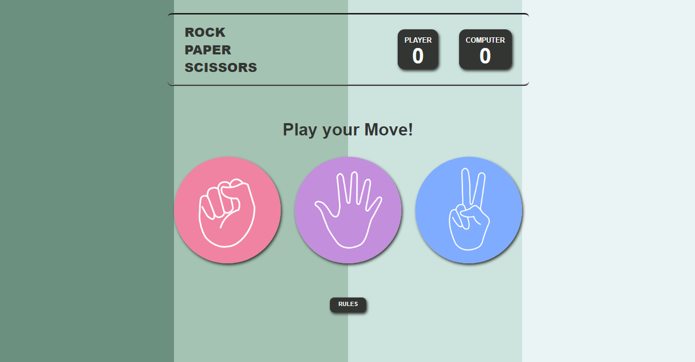

# Rock, Paper, Scissors Game




Welcome to the Rock, Paper, Scissors Game project! This simple and interactive web-based game is built using HTML5, CSS3, and JavaScript. Test your luck and strategy against the computer in the classic Rock, Paper, Scissors duel.

## Live Demo

Check out the live demo of the Rock, Paper, Scissors Game [here](https://chauhan-hardik.github.io/Rock-Paper-Scissors/).

## Features

- **User-friendly Interface:** Enjoy a clean and intuitive design for an immersive gaming experience.

- **Responsive Layout:** The game adapts to different screen sizes, ensuring a seamless play on various devices.

- **Score Tracking:** Keep track of your wins against the computer with a visible score display.

- **Engaging Messages:** Receive informative and entertaining messages throughout the game.

## How to Play

1. **Choose Your Move:**
   - Click on the Rock, Paper, or Scissors images to make your move.

2. **Game Result:**
   - The game will determine the winner based on your choice and the computer's random move.

3. **Score Updates:**
   - Track your score to see who is dominating the Rock, Paper, Scissors battlefield.

## Installation

1. Clone the repository to your local machine:

   ```bash
   git clone https://github.com/chauhan-hardik/Rock-Paper-Scissors.git

## Contributing
Contributions are welcome! If you have ideas for improvements, find bugs, or want to enhance the project, please open an issue or submit a pull request.
